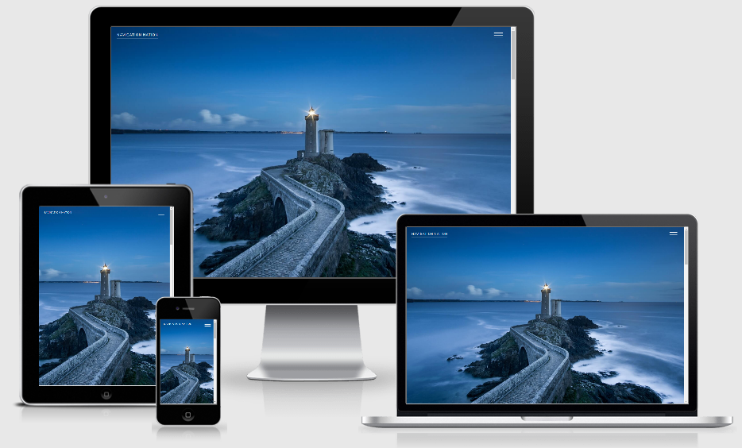

# Navigation Template

## Overview
- A single page website using vanilla JS to animate navigation. 

## Technologies
- [CSS Animation](https://developer.mozilla.org/en-US/docs/Web/CSS/animation)

## Credits

### Content
- Colors from [Palleton](https://paletton.com/)
- How to Create a Menu Icon from [W3Schools](https://www.w3schools.com/howto/howto_css_menu_icon.asp)
- Hero image from [William Bout](https://unsplash.com/@williambout)